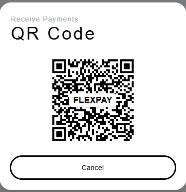

# FlexPay

FlexPay is a full-stack fintech application designed to modernize digital payments, allowing users to manage transactions, check wallet balances, and facilitate secure payments seamlessly.

## Table of Contents
- [Live Demo](#live-demo)
- [Features](#features)
- [Tech Stack](#tech-stack)
- [Folder Structure](#folder-structure)
- [Deployment Instructions](#deployment-instructions)
- [User Instructions](#user-instructions)
- [API Endpoints](#api-endpoints)
- [Environment Variables](#environment-variables)
- [Testing](#testing)
- [License](#license)
- [Contributors](#contributors)
- [Future Enhancements](#future-enhancements)
- [Contact](#contact)

---

## Live Demo
**[FlexPay Deployed on Render](https://flexpay-nmt5.onrender.com/)**

---

## Features
- Secure **User Authentication** (JWT)
- Digital Wallet with **Balance Tracking**
- **Transaction History** with real-time updates
- Full **GraphQL API** for frontend-backend communication
- **Vite + React + TypeScript** for frontend
- **Apollo Server + MongoDB** for backend
- **AI Chatbot** for FAQs

---

## Tech Stack
### Frontend
- Vite + React + TypeScript
- Apollo Client for GraphQL
- TailwindCSS for styling
- React Router for navigation

### Backend
- Node.js + Express
- Apollo Server (GraphQL API)
- MongoDB + Mongoose (Database)
- JWT Authentication

---

## Folder Structure
```
FlexPay
├── client/  # Frontend (Vite + React)
│   ├── src/
│   ├── public/
│   ├── index.html
│   └── package.json
│
├── server/  # Backend (Express + Apollo Server)
│   ├── src/
│   ├── dist/
│   ├── config/
│   ├── models/
│   ├── graphql/
│   ├── routes/
│   ├── app.ts
│   └── package.json
│
└── .github/workflows/  # CI/CD workflows
```

---

## Deployment Instructions
### 1️⃣ Clone the Repository
```bash
git clone https://github.com/Hagustin/FlexPay.git
cd FlexPay
```

### 2️⃣ Install Dependencies
```bash
npm install
```

### 3️⃣ Start Development Mode
```bash
npm run start
```
- Frontend: `http://localhost:5173`
- Backend: `http://localhost:3001/graphql`

### 4️⃣ Build for Production
```bash
npm run build
npm run dev
```
- Backend serves the frontend in **production mode**

---

## User Instructions

Upon opening the application, users will land on the 'SignUp' page:


To login, users can enter the following login details: 
user: 'lach@test.com'
password: '1234'


Users will see their starting wallet displayed:


Users can click 'deposit' to open up their camera, which will allow them ro 'receive funds':


Users can also click 'payments', to send funds:


After entering the amount the user wishes to send, they can generate a QR code, for the receiver to scan:



After the receiver has scanned the QR Code, they will see their wallet balance update with the amount transferred:


Users can see their recent transaction history below their wallet balance:


## API Endpoints
| Endpoint           | Method | Description |
|-------------------|--------|-------------|
| `/graphql`       | `POST` | GraphQL API for all requests |
| `/auth/register` | `POST` | Register a new user |
| `/auth/login`    | `POST` | Authenticate user & return JWT |
| `/transactions`  | `GET`  | Fetch transaction history |
| `/wallet/balance` | `GET`  | Get wallet balance |

---

## Environment Variables (`.env`)
```env
NODE_ENV=production
PORT=3001
MONGODB_URI=mongodb+srv://your-mongo-url
JWT_SECRET_KEY=your-secret-key
GEMINI_API_KEY='your_key_here'
```

---

## Testing
### Run Backend Tests
```bash
cd server
npm run test
```

### Run Frontend Tests
```bash
cd client
npm run test
```

---

## License
This project is licensed under **MIT License**.

---

## Contributors
- **Henry Agustin** ([GitHub](https://github.com/Hagustin))
- **Shareef Evans** ([GitHub](https://github.com/shareefevans))
- **Lachlan Miles** ([GitHub](https://github.com/lachieMiles))


---

## Future Enhancements
- ✅ **QR Code Transactions**
- ✅ **Mobile Payment Integration**
- ✅ **AI-powered Financial Insights**

---

## Contact
- 📩 **Henry Agustin** - ([LinkedIn](https://www.linkedin.com/in/henry-agustin-40896374/))
- 📩 **Shareef Evans** - ([LinkedIn](https://www.linkedin.com/in/shareef-evans/))
- 📩 **Lachlan Miles** - ([LinkedIn](https://www.linkedin.com/in/lachlan-miles-b69269181/))
